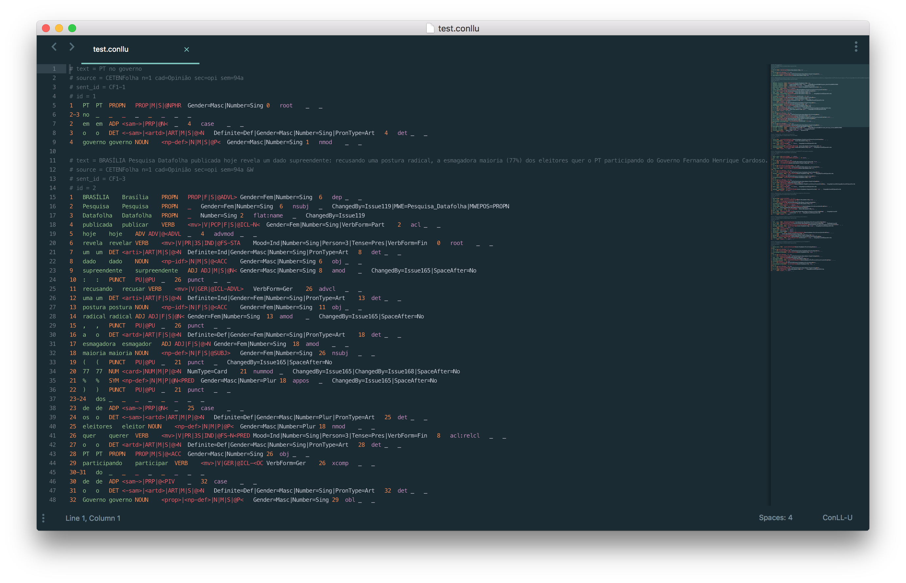

# CoNLL-U Syntax Highlighting for Sublime Text

The CoNLL-U format is defined on the [Universal Dependencies](http://universaldependencies.org/format.html) website. Scope naming has been changed from what was [originally proposed](https://github.com/odanoburu/conllu-linguist-grammar/blob/master/text.conllu.json) in order to create better syntax highlighting for Sublime Text. The regular expression has also been changed to match for whitespaces (`\s`) instead of tabs (`\t`). An [Atom extension](https://atom.io/packages/language-conllu) exists for CoNLL-U highlighting by [@Evpok](https://github.com/Evpok).

## Installation
Adapted from [@alexlouden](https://github.com/alexlouden/)'s [README on Terraform.tmLanguage](https://github.com/alexlouden/Terraform.tmLanguage/blob/master/README.md)

### Using Package Control

1. Having [Package Control](https://packagecontrol.io/installation) installed
2. Open the palette by pressing `Ctrl+Shift+P` (Win, Linux) or `Cmd+Shift+P` (OS X).
3. Select _"Package Control: Install package"_
4. Select _"CoNLL-U"_

### Manually

1. Open the Sublime Text Packages folder
    - OS X: `~/Library/Application Support/Sublime Text 3/Packages/`
    - Windows: `%APPDATA%/Sublime Text 3/Packages/`
    - Linux (Ubuntu/Debian): `~/.config/sublime-text-3/Packages/`
2. Clone this repo

## Acknowledgements

Thanks to [Bruno Cuconato](https://github.com/odanoburu) for the [grammar](https://github.com/odanoburu/conllu-linguist-grammar).
